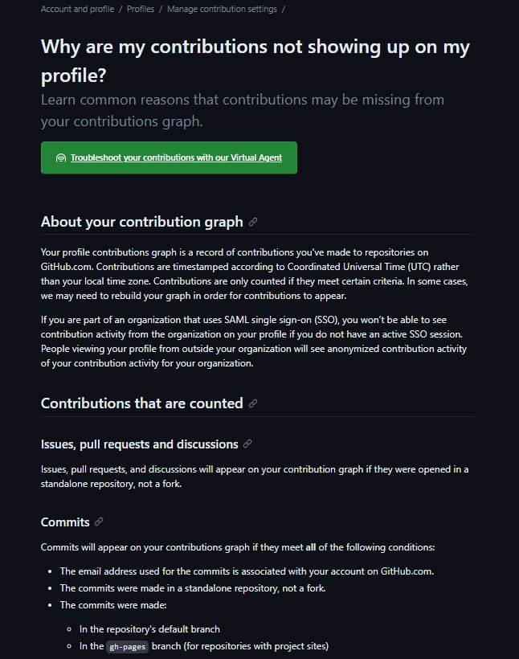
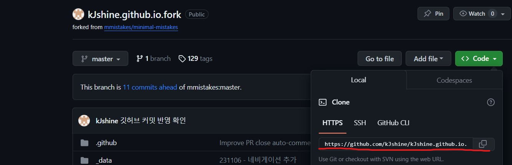

오늘은 Git hub 블로그를 작업하면서 내가 커밋을 해도 잔디가 심어지지 않는 것을 발견하게 되었다.
검색을 통해 나와 같은 문제(?)를 겪은 사람들이 꽤 많았고 여러 해결책들이 있었다

그 중에서 발견한 Git hub 공식문서의 Manage contribution 탭을 보면



**위처럼 커밋으로 인정되는 조건**들이 적혀있다.

검색했을 때 대다수의 사람들은   
The email address used for the commits is associated with your account on GitHub.com.   
**즉, Git hub 계정과 커밋 이메일 계정이 동일하지 않아서 생기는 이유**가 이유였다.

나의 경우에는 Git hub 계정과 커밋 이메일 계정은 동일하였고 다른 원인에 의해 문제가 있다고 판단하였다.   

또다른 커밋으로 인정되는 조건중에는   
The commits were made in a standalone repository, not a fork.   
**fork한 repository가 아닌 나의 repository에서 커밋**이 있었다.

내가 사용한 Git hub 블로그는 <a href="https://github.com/topics/jekyll-theme">https://github.com/topics/jekyll-theme</a>에 있는 repository를 fork하여 사용하고 있었고 이 때문에 커밋이 되어도 잔디가 심어지지 않았던 것이다...   

fork한 repository에 잔디를 심는방법을 찾아보니   
기존에 fork해온 repository를 복사해서 나의 Git hub에 새로운 repository로 복사하는 것이다. 방법은

### 내 Git hub에 새로운 repository 생성


### 복사하려는 fork된 repository의 주소를 복사한다



### 터미널을 열고 복사한 주소를 bare clone 한다
fork된 repositoty 주소: https://github.com/kJshine/kJshine.github.io.fork.git
```bash
$ git clone --bare https://github.com/kJshine/kJshine.github.io.fork.git
```

### 새로운 repository로 Mirror-push 한다
새로운 repositoty 주소: https://github.com/kJshine/kJshine.github.io.fork.git
```bash
$ git push --mirror https://github.com/kJshine/kJshine.github.io.git
```

이러면 기존 fork된 repository에서 작업했던 커밋도 contribution되어 잔디에 반영이 되는 것을 확인할 수 있다.

<div class="notice--success">
<h4>[정보 출처]</h4>
<ul>
    <li><a href="https://docs.github.com/en/account-and-profile/setting-up-and-managing-your-github-profile/managing-contribution-settings-on-your-profile/why-are-my-contributions-not-showing-up-on-my-profile">Git hub 공식문서</a></li>
    <li><a href="https://soranhan.tistory.com/11">티스토리 블로그</a></li>
</ul>
</div>

<!-- **[정보 출처]** [Git hub 공식문서](https://docs.github.com/en/account-and-profile/setting-up-and-managing-your-github-profile/managing-contribution-settings-on-your-profile/why-are-my-contributions-not-showing-up-on-my-profile)
{: .notice--info} -->